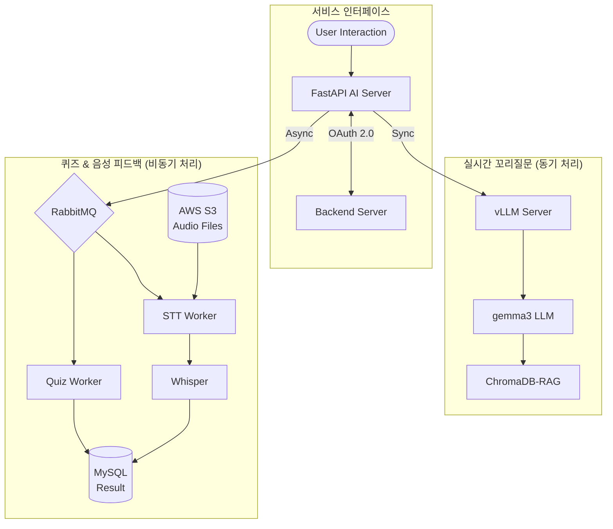

# WingTerView - AI Service (10조 모의면접 매칭 및 퀴즈 서비스)

📌 **프로젝트 개요**
- **서비스명:** WingTerView - AI 기반 모의면접 및 복습 서비스
- **AI Service 역할:** 본 리포지토리는 WingTerView 서비스의 핵심 AI 기능을 담당하며, 실제 면접관처럼 사용자와 상호작용하고 개인화된 학습 경험을 제공합니다.
    - 면접 질문에 대한 심층 꼬리질문 실시간 생성
    - 사용자의 면접 기록 기반 맞춤형 복습 퀴즈 생성
    - STT 변환 텍스트 기반 음성 면접 분석 및 피드백 제공

📦 **주요 기능**

| 기능                  | 설명                                                                                                           |
| :-------------------- | :------------------------------------------------------------------------------------------------------------- |
| 면접 꼬리질문 생성    | 선택 질문, 키워드, 과거 질문 기록, 유사 질문을 기반으로 문맥에 맞는 꼬리질문 생성               |
| 복습용 퀴즈 생성      | 사용자의 면접 기록을 분석하여 4지선다형 복습 퀴즈 10개 자동 생성 (문제, 보기, 정답, 해설 포함)                 |
| 음성 기반 피드백 생성 | 면접 중 녹음된 음성(STT 변환 텍스트)을 분석하여 면접 태도, 답변 내용 등에 대한 피드백 요약 및 개선 포인트 제공 |

---

🏗️ **시스템 아키텍처**

- **AI 면접관:** `vLLM` + `gemma3-4bit LoRA Fine-tuned` 모델로 실시간 꼬리질문 생성
- **비동기 처리:** `RabbitMQ`를 통해 퀴즈 생성 및 음성 분석을 백그라운드에서 처리하여 사용자 대기 시간 최소화
- **독립적인 STT 파이프라인:** 음성 파일 처리(`S3` 저장), `STT` 변환, 피드백 생성 과정은 비동기적으로 처리되며 별도의 흐름으로 관리됨.
- **Vector DB:** `ChromaDB` 기반 RAG로 최신 기술 면접 질문/문서를 검색하여 답변 정확성 강화
- **모니터링:** `Langfuse` & `Langsmith`를 통해 LLM 응답 품질 및 지연 시간 실시간 추적

---

🛠️ **기술 스택**

| **영역**                 | **사용 기술**                             | **버전 (명시된 경우)** | **선택 이유 및 장점**                                                                                     |
| ------------------------ | ----------------------------------------- | ---------------------- | --------------------------------------------------------------------------------------------------------- |
| **개발 언어**            | `Python`                                  | `3.11.12`              | AI 및 비동기 서버 환경에 최적화되어 있으며, 주요 라이브러리와의 호환성이 뛰어남                           |
| **AI 서버 및 서빙**      | `FastAPI` + `vLLM`                        | `0.115.9` / `0.8.5`    | FastAPI는 비동기 고성능 API 서버, vLLM은 PagedAttention 기반 초고속 추론으로 대규모 동시 요청 처리에 적합 |
| **LLM 추론 프레임워크**  | `PyTorch`                                 | `2.6.0`                | LLM 및 fine-tuning에 널리 사용되는 프레임워크, vLLM, LoRA, STT 등과의 높은 호환성 제공                    |
| **LLM 체인 구성**        | `LangChain`                               | `0.3.24`               | 체인/프롬프트/메모리 등의 모듈화로 복잡한 LLM 기반 서비스 구성에 용이함                                   |
| **사전학습 모델 소스**   | `Transformers` (Hugging Face)             | `4.51.3`               | 다양한 LLM 모델을 쉽게 불러오고 fine-tuning 가능, vLLM 및 LangChain과의 호환성 우수                       |
| **LLM 모델**             | `Qwen3` (4B / 2B, LoRA fine-tuned)        | -                      | 최신 경량 구조 기반 LLM, LoRA를 통한 도메인 특화 튜닝으로 성능 효율적 향상 가능                           |
| **RAG (Vector DB)**      | `ChromaDB`                                | `1.0.7`                | 문서 임베딩 기반의 빠르고 확장성 있는 벡터 검색 지원, RAG 연동에 최적화                                   |
| **벡터 임베딩 모델**     | `Alibaba-NLP/gte-multilingual-base`       | -                      | 한국어 포함 다국어 임베딩에 강력하며, GTE 계열로 높은 성능과 효율적인 RAG 통합 지원                       |
| **음성 인식(STT)**       | `Whisperㅌ` (openai-whisper 기반)           | `1.1.10`               | 고정밀 음성 인식 가능, 면접 음성 피드백 기능에 적용됨                                                     |
| **LLM 모니터링 및 평가** | `LangSmith` + `Langfuse`                  | `0.3.33` / `2.60.3`    | LangSmith: LLM 응답 평가 관리, Langfuse: 요청별 트레이스와 실시간 품질/지연 시간 추적 가능                |
| **데이터 저장소**        | AWS S3, MySQL                             | -                      | S3: 음성 파일 등 대용량 비정형 데이터 저장, MySQL: 질문/퀴즈/피드백 등 정형 데이터 관리                   |
| **배포 및 인프라**       | GCP Compute Engine, Docker, Jenkins CI/CD | -                      | GCP: AI 추론 서버 호스팅, Docker: 이식성과 환경 일관성 확보, Jenkins: 지속적 배포 자동화 파이프라인 지원  |

---

📡 **API 주요 엔드포인트**

| 기능 | Endpoint | 설명 | 처리 방식 |
|:---|:---|:---|:---|
| **꼬리질문 생성** | `/interview/followup-questions` | 선택 질문 기반 심층 꼬리질문 생성 | 동기 (즉시 응답) |
| **복습 퀴즈 생성** | `/quiz/generate` | 면접 기록 기반 4지선다 퀴즈 10개 (해설 포함) 자동 생성 | 비동기 (RabbitMQ) |
| **음성 면접 분석** | `/stt/submit` | S3 음성 파일 URI 기반 STT 및 피드백 생성 요청 | 비동기 (RabbitMQ) |
| **상태 확인** | `/health` | AI 모델 및 서버 상태 실시간 확인 | 동기 (즉시 응답) |

---

🧠 **처리 흐름 요약**

1.  **면접 꼬리질문 생성 (Follow-up Questions)**
    * 입력: 사용자가 선택한 질문, 관련 키워드, 해당 사용자의 과거 질문 기록, DB 내 유사 질문
    * 처리: 입력 정보를 조합하여 Prompt 구성 후 LLM(Gemma) 호출 (vllm 활용)
    * 출력: 문맥에 맞는 꼬리질문 생성 
    * 저장: 생성된 질문은 MySQL에 기록

2.  **복습 퀴즈 생성 (Quiz Generation)**
    * 입력: 특정 사용자의 면접 질문/답변 기록 (MySQL 조회)
    * 처리: 면접 기록을 바탕으로 퀴즈 생성용 Prompt 구성 후 LLM(Gemma) 호출 (LangChain 활용)
    * 출력: 4지선다형 객관식 문제 10개 (문제, 보기, 정답, 해설 포함)
    * 저장: 생성된 퀴즈 세트는 사용자별로 MySQL에 저장

3.  **STT 기반 피드백 생성 (Interview Feedback)**
    * 시작: 사용자가 면접 음성 파일 업로드 (클라이언트 -> S3)
    * 요청: 백엔드 서버에서 `/stt/submit` API 호출 (S3 URI 전달)
    * 처리 (AI 서버):
        1.  S3에서 음성 파일 다운로드
        2.  Whisper 모델을 사용하여 STT 수행 -> 텍스트 변환
        3.  변환된 텍스트를 기반으로 면접 피드백 생성 Prompt 구성 후 LLM(Gemma) 호출 (LangChain 활용)
        4.  생성된 피드백 요약 및 개선점 결과 저장 (MySQL)
    * 알림: 처리 완료 후 Webhook을 통해 백엔드 서버로 결과 전송 알림

---

🚀 **개발 워크플로우 및 CI/CD**

### 브랜치 전략 (Branching Strategy)

| 브랜치      | 목적               | CI 실행 단계                                             | 병합 대상     | 병합 조건                                             |
| :---------- | :----------------- | :------------------------------------------------------- | :------------ | :---------------------------------------------------- |
| `feature/*` | 기능 단위 개발     | CI 없음 (정적 분석 및 테스트 생략)                       | `dev`         | 기능 개발 완료 후 PR 생성, 코드 리뷰 승인 시 병합     |
| `dev`       | 통합 개발 및 QA    | 전체 파이프라인 실행 (빌드, 정적 분석, 테스트, 커버리지) | `main`        | QA 완료 및 팀 승인 또는 일정 기반 배포 시점에 병합    |
| `main`      | 릴리즈/운영 브랜치 | 전체 재검증 실행 + 태그 생성 가능                        | (없음)        | 병합 후 배포 수행, 안정화 완료 후 hotfix 병합 가능    |
| `hotfix/*`  | 운영 중 긴급 수정  | 전체 파이프라인 실행                                     | `main`, `dev` | 빠른 수정 적용 후 main에 병합, dev와 코드 동기화 필요 |

---
**성능 최적화 및 모델 튜닝**

-   **vLLM 고속 추론:** PagedAttention 기술을 활용하여 LLM 서빙 처리량(Throughput)을 극대화하고 응답 지연 시간(Latency)을 단축하여 다수의 동시 면접 요청을 원활하게 처리합니다.
-   **LoRA 파인튜닝:** 경량 모델인 `Gemma3` 및 `Qwen3`를 개발자 면접 데이터로 LoRA 파인튜닝하여, 적은 리소스로 특정 도메인(기술 면접)에 대한 질문/답변 생성 능력을 극대화했습니다.
-   **RAG 정확도 향상:** `ChromaDB`에 최신 IT 기술 문서와 면접 질문 데이터를 지속적으로 업데이트하여, LLM이 최신 정보를 기반으로 정확하고 깊이 있는 답변을 생성하도록 보강합니다.

---

⚙️ **인프라 및 배포**

-   **컨테이너화:** Docker를 사용하여 AI 서버 애플리케이션을 이미지로 빌드.
-   **CI/CD:** Jenkins 파이프라인을 구축하여 코드 변경 시 자동 빌드, 테스트, 배포 수행.
-   **무중단 배포:** Blue-Green 배포 전략을 적용하여 서비스 중단 없이 안정적으로 업데이트 배포.
-   **오토스케일링:** GCP Compute Engine의 AutoScaler를 설정하여 트래픽 부하에 따라 자동으로 인스턴스 수를 조절.

---

🛡️ **보안 및 안정성**

-   **인증:** OAuth 2.0 기반 인증을 통해 API 접근 제어 (백엔드 서버와의 연동).
-   **Rate Limiting:** 과도한 요청을 방지하기 위해 API 요청 빈도 제한 적용 (`429 Too Many Requests` 처리).
-   **Health Check:** API 서버의 상태를 주기적으로 확인하는 Health Check 엔드포인트 구현 및 모니터링 (향후 Slack 알림 연동 예정).
-   **S3 보안:** S3 버킷 접근 권한 제어 및 업로드 파일에 대한 유효성 검증 수행.

---

